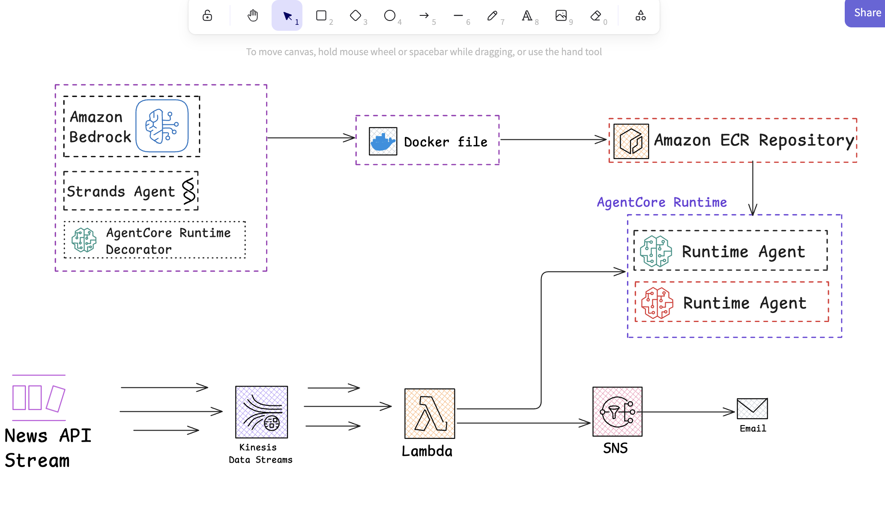

# Mastering AWS AgentCore 
Amazon Bedrock AgentCore enables you to deploy and operate highly effective agents securely, at scale using any framework and model. With Amazon Bedrock AgentCore, developers can accelerate AI agents into production with the scale, reliability, and security, critical to real-world deployment. AgentCore provides tools and capabilities to make agents more effective and capable, purpose-built infrastructure to securely scale agents, and controls to operate trustworthy agents. Amazon Bedrock AgentCore services are composable and work with popular open-source frameworks and any model, so you don’t have to choose between open-source flexibility and enterprise-grade security and reliability

## This project focuses on AgentCore Runtime(serverless, low-latency execution))
Flash-News Stream Summarizer is an agent invoked by an Amazon Kinesis stream that ingests >1 k msg/s, clusters breaking headlines, and pushes 200-character digests to SNS mobile topics in < 2 seconds.

### Why this feature matters
Runtime is the bedrock (pun intended) that lets an AI agent autoscale exactly like Lambda, but with longer-lived sessions for planning loops.

### What students practice (hands-on)

- Configure AgentCore Runtime for burst concurrency.
- Tune cold-start budgets and latency budgets.
- Stress-test with Kinesis Data Generator.

### What we're 


### Locally test agent

Run the following command in the cli
```bash
 jq -r '.articles[].title | @json' sample_news.json | \
while read -r TITLE_JSON; do
  echo "Testing: $TITLE_JSON"

  curl -s -X POST http://localhost:8080/invocations \
       -H "Content-Type: application/json" \
       -d "{\"headline\": ${TITLE_JSON}}"
done
```